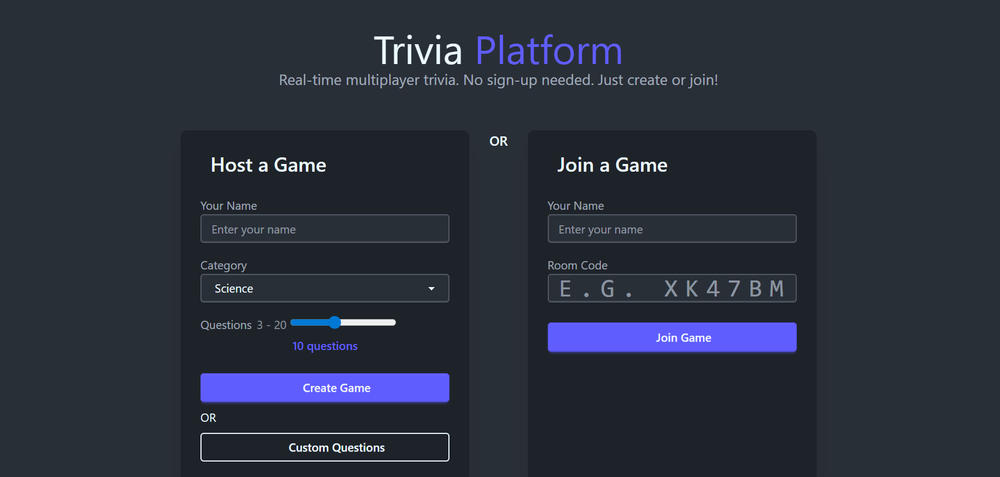
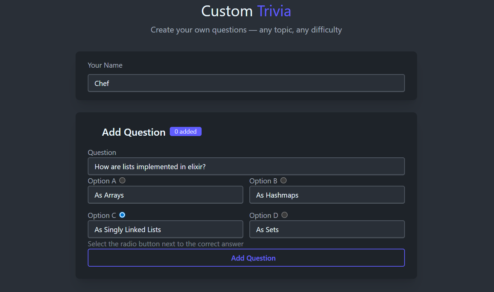
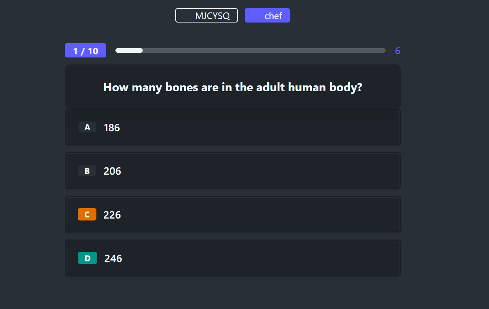

# Trivia Platform

Real-time multiplayer trivia game built with Elixir, Phoenix LiveView, and OTP.

No sign-up required. One player creates a room, shares a 6-character code, others join and play in real-time through their browser.

## Screenshots

### Home - Host or Join a Game


### Custom Question Builder


### Gameplay - Answer Within 15 Seconds


## How it works

1. **Host** creates a game room — pick a category from the database, or build custom questions on any topic
2. **Players** join using the 6-character room code (no account needed)
3. **Host** starts the game, everyone sees questions simultaneously via WebSocket
4. **Players** answer within 15 seconds — faster correct answers = more points
5. **Leaderboard** updates after each question, final results saved to database

## Tech stack

| Layer | Technology | Why |
|-------|-----------|-----|
| Language | Elixir 1.19 / OTP 28 | Per-room GenServer processes, fault-tolerant supervision, built for concurrency |
| Web | Phoenix 1.8 + LiveView 1.1 | Real-time server-rendered UI over WebSocket, zero client-side JS framework needed |
| Database | PostgreSQL | Persistent storage for questions and game history |
| Styling | Tailwind CSS 4 + DaisyUI | Utility-first CSS with pre-built components |
| HTTP Server | Bandit | Pure-Elixir HTTP server, first-class WebSocket support |

## Features

- **DB-backed questions** — 55 seed questions + bulk import from Open Trivia DB (500+ questions via `mix import_questions`)
- **Custom questions** — host builds their own trivia on any topic, no database needed
- **Auto-refresh** — production GenServer imports new questions weekly from Open Trivia DB
- **Real-time sync** — all players see the same question, timer, and results simultaneously
- **Speed scoring** — correct answers earn more points the faster you answer (100-1500 per question)
- **Reconnection** — signed tokens let players rejoin mid-game if they lose connection
- **Game history** — completed games saved to PostgreSQL with permanent results page

## Quick start

**Prerequisites:** Elixir 1.19+, PostgreSQL running locally

```bash
# Clone and setup
git clone <repo-url>
cd trivia_platform
mix deps.get

# Create database, run migrations, seed questions
mix ecto.setup

# (Optional) Import 500+ questions from Open Trivia DB
mix import_questions

# Start the server
mix phx.server
```

Visit [localhost:4000](http://localhost:4000).

**Note:** PostgreSQL password is configured as `"elixir"` in `config/dev.exs`. Change it if yours differs.

## Testing

```bash
mix test          # 92 tests
mix test --trace  # verbose output with test names
```

Tests include a full multiplayer game simulation (host + 2 players, all questions, scoring, DB persistence) without needing multiple browsers. See `test/trivia_platform_web/live/game_loop_test.exs`.

## Manual testing

Open 3 browser tabs to `localhost:4000`:
1. **Tab 1** (Host): Create a game -> note the room code
2. **Tab 2** (Player 1): Join with the room code
3. **Tab 3** (Player 2): Same, different name

Each tab is an independent WebSocket connection — identical to 3 different devices.

## Documentation

Full architecture documentation (supervision tree, state machine, security model, edge cases, deployment guide) is in `docs/DOCS.md`.

Future upgrade plans (question types, game modes, auth, clustering) are in `docs/FUTURE.md`.
